# Informe de Auditoría de Sistemas - Examen de la Unidad I

**Nombres y apellidos:** Daleska Nicolle Fernandez Villanueva  
**Fecha:** 22/04/2026  
**URL GitHub:** [https://github.com/Daleskadf/examen_audit_u1](https://github.com/Daleskadf/examen_audit_u1)

---

## Proyecto de Auditoría de Riesgos

### Login
**Evidencia:**  
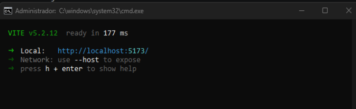
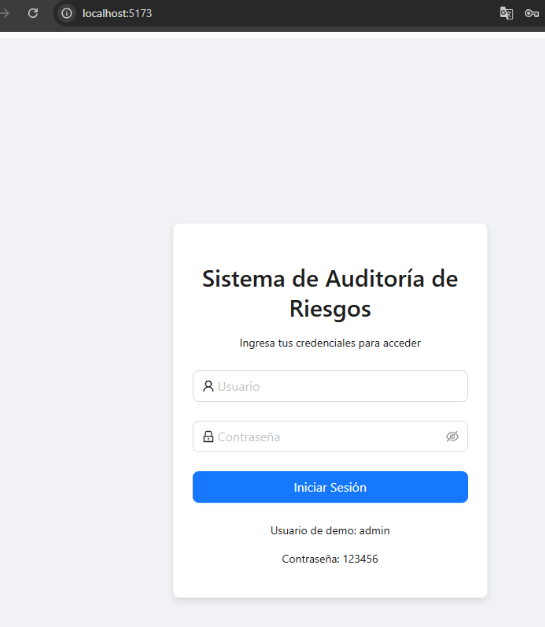

**Descripción:**  
El inicio de sesión se implementó mediante un servicio de **autenticación centralizado** (`LoginService.js`) que funciona de manera **ficticia y sin base de datos**, cumpliendo con los requerimientos del examen. La validación se realiza comparando las credenciales ingresadas por el usuario contra un objeto de datos estáticos (*hardcoded*) definido en el código. Además, se utilizaron **Promesas** y un `setTimeout` de 500ms para simular la latencia de una red real, y se empleó **localStorage** para gestionar la persistencia de la sesión mediante un token ficticio.

---

### Motor de Inteligencia Artificial
**Evidencia:**  
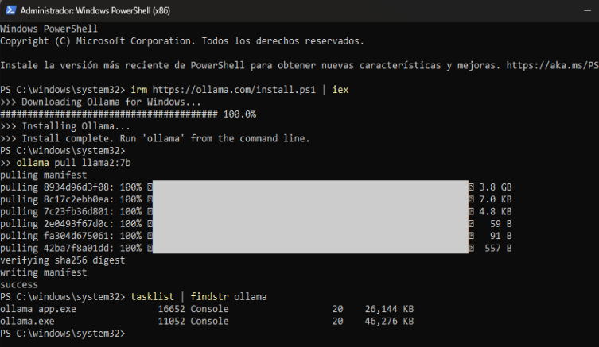
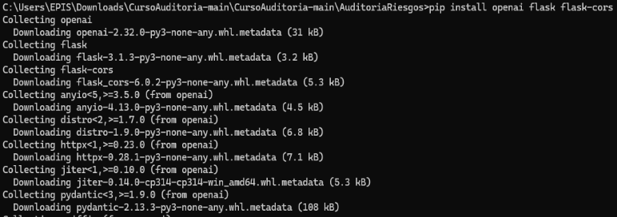
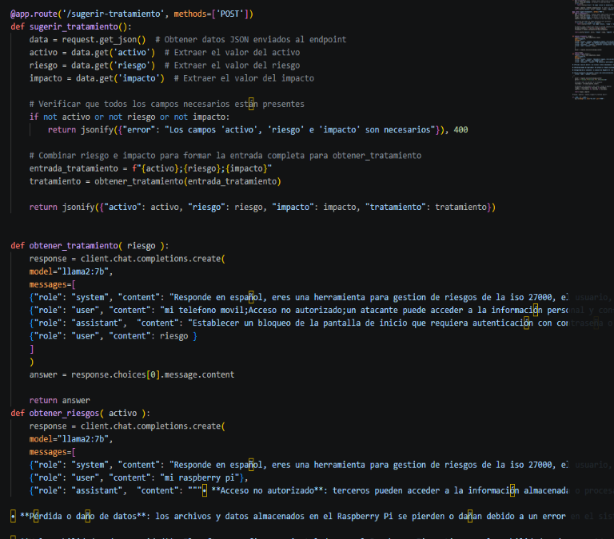

**Descripción:**  
Se implementó un motor de IA mejorado utilizando técnicas de **Prompt Engineering** y el modelo **Llama2:7b** ejecutado de manera local mediante **Ollama**. La mejora principal radica en la configuración de un **System Prompt** que define el rol del modelo como una herramienta especializada en la normativa **ISO 27000**. 

Además, se aplicó la técnica de **Few-Shot Prompting**, proporcionando ejemplos de entrada y salida (como los casos del 'teléfono móvil' y 'Raspberry Pi') para condicionar el comportamiento de la IA. Esto garantiza que el sistema genere hallazgos técnicos estructurados y recomendaciones de tratamiento precisas, limitadas a 200 caracteres para mantener la claridad en los reportes de auditoría.

---

## Hallazgos
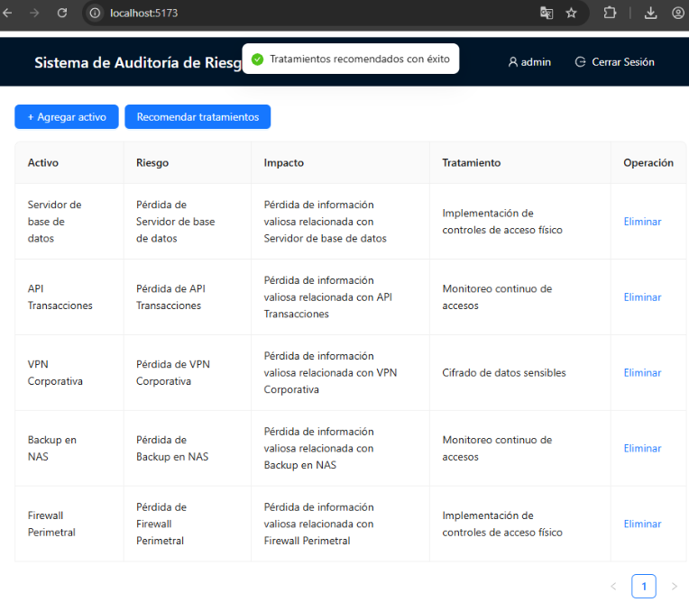  

**Activo 1: Servidor de base de datos**  
*   **Evidencia:** 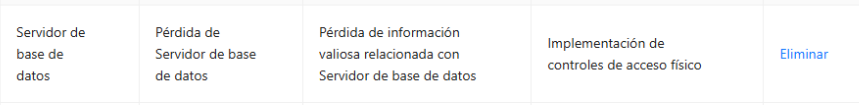  
*   **Condición:** Vulnerabilidad ante accesos no autorizados que comprometan la integridad de los datos financieros.  
*   **Recomendación:** Implementación de controles de acceso físico y lógico estricto para restringir la entrada a personal no autorizado.  
*   **Riesgo:** Alta

**Activo 2: API Transacciones**  
*   **Evidencia:** 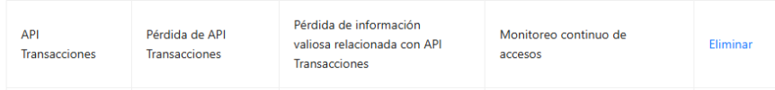  
*   **Condición:** Posibilidad de intercepción de tráfico o ataques de denegación de servicio en las interfaces de conexión.  
*   **Recomendación:** Realizar un monitoreo continuo de accesos y solicitudes para detectar comportamientos anómalos en tiempo real.  
*   **Riesgo:** Alta

**Activo 3: VPN Corporativa**  
*   **Evidencia:** 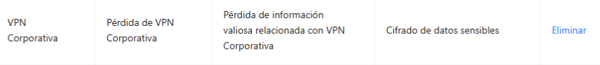  
*   **Condición:** Exposición de datos de empleados y de la empresa durante el tránsito por redes públicas.  
*   **Recomendación:** Aplicar el cifrado de datos sensibles mediante protocolos robustos (como AES-256) para asegurar la confidencialidad.  
*   **Riesgo:** Media

**Activo 4: Backup en NAS**  
*   **Evidencia:** 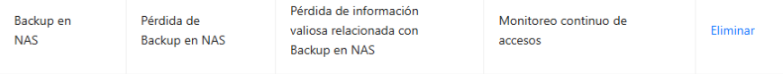  
*   **Condición:** Riesgo de pérdida de disponibilidad de los respaldos si no se supervisan los intentos de conexión.  
*   **Recomendación:** Establecer un monitoreo continuo de accesos al dispositivo de almacenamiento y verificar la integridad de las copias.  
*   **Riesgo:** Media

**Activo 5: Firewall Perimetral**  
*   **Evidencia:** 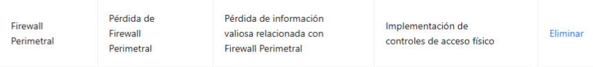  
*   **Condición:** Debilidad en el perímetro de seguridad que podría permitir la entrada de amenazas externas.  
*   **Recomendación:** Implementación de controles de acceso físico a los equipos de red y revisión periódica de las reglas del cortafuegos.  
*   **Riesgo:** Alta

---

## Anexo 1: Activos de información 

| # | Activo | Tipo |
|---|---|---|
| 1 | Servidor de base de datos | Base de Datos |
| 2 | API Transacciones | Servicio Web |
| 5 | Firewall Perimetral | Seguridad |
| 8 | Backup en NAS | Almacenamiento |
| 11 | VPN Corporativa | Infraestructura |

*(Nota: Se evaluaron 5 activos seleccionados de la lista general del Anexo 1 conforme a las instrucciones del examen).*
